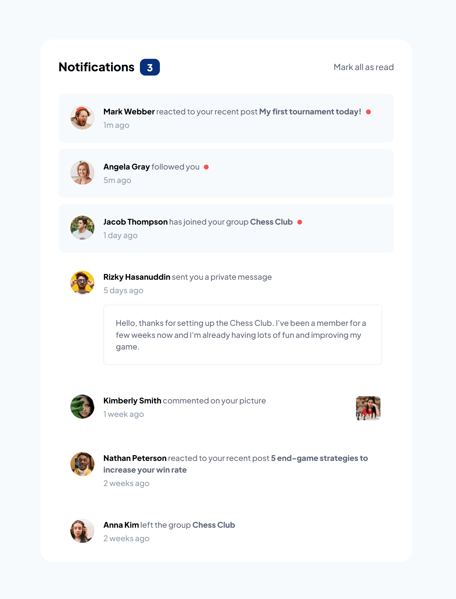
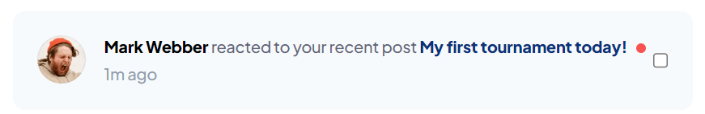
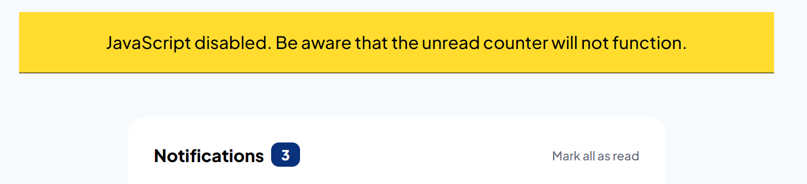
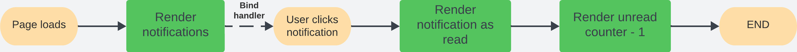
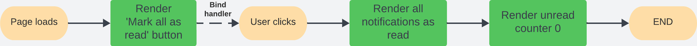

# Frontend Mentor - Notifications page

This is a solution to the [Notifications page challenge on Frontend Mentor](https://www.frontendmentor.io/challenges/notifications-page-DqK5QAmKbC). Frontend Mentor challenges help you improve your coding skills by building realistic projects.

Difficulty: `junior`

[//]: # 'Insert screenshot below'

## Table of contents

- [Frontend Mentor - Notifications page](#frontend-mentor---notifications-page)
  - [Table of contents](#table-of-contents)
  - [Overview](#overview)
    - [The challenge](#the-challenge)
    - [Links](#links)
  - [My process](#my-process)
    - [Built with](#built-with)
    - [What I learned](#what-i-learned)
      - [Progressive enhancement](#progressive-enhancement)
    - [Continued development](#continued-development)
    - [Useful resources](#useful-resources)
  - [Project information](#project-information)
    - [User stories and features](#user-stories-and-features)
    - [Flowchart](#flowchart)
  - [Author](#author)

## Overview

### The challenge

To build the Notifications page according to the given designs as close as possible.
The users should be able to:

- Distinguish between "unread" and "read" notifications
- Select "Mark all as read" to toggle the visual state of the unread notifications and set the number of unread messages to zero
- View the optimal layout for the interface depending on their device's screen size
- See hover and focus states for all interactive elements on the page

### Links

- Solution URL: [Open GitHub repository](https://github.com/YariMorcus/fm-notifications-page)
- Live Site URL: [open Netlify](https://notifications-page-yari-morcus.netlify.app)

## My process

### Built with

- Semantic HTML5 markup
- CSS _(BEM naming convention used, [see getbem.com](http://getbem.com) for more information)_
- Flexbox
- ES6 classes
- Mobile-first workflow
- Progressive enhancement
- Optimized for both Open Graph (Facebook) and Twitter Cards
- [Node.js](https://nextjs.org/) - Open source and multiplatform JavaScript runtime environment
- [NPM](https://www.npmjs.com/) - Package Manager for Node JavaScript platform
- [Parcel](https://parceljs.org/) - Zero configuration build tool / module bundler to automate workflow
- [Sass](https://sass-lang.com/) - CSS Preprocessor (in collaboration with Parcel)
- [GitHub](https://github.com/) - Technological platform based on Git
- [Git](https://git-scm.com/) - Free and open source distributed version control system
- [Netlify](https://www.netlify.com/) - Free service to host static webpages and web applications

### What I learned

1. Always use semantic compliant-standard HTML
2. To keep testing the application for Web Accessibility
3. To apply progressive enhancement if needed
4. To spend time looking at the details of the designs to create the application as accurately as possible
5. How to write documentation for functions
6. How to solve problems with a framework _(provided by a [course](https://www.udemy.com/course/the-complete-javascript-course/) I followed)_
7. How to create a flowchart based on the given project information

#### Progressive enhancement

When JS is not available, checkboxes [^1] will be shown to the right of the unread notifications.
When user presses the checkbox, the notification will be marked as read.

_The unread counter does not work without JS. The user is notified in this case. [^2]_

[^1]:
    Checkboxes on the right
    

[^2]:
    Warning for not functioning counter
    

### Continued development

The way I want to continue to develop myself is by focusing on laying out a proper foundation of HTML, CSS, and JavaScript.
This so I can build quality websites for clients by just using the core languages of the Web.
At the present, I am working on the above things by going through (interactive) articles on the MDN Web Docs (see chapter [Useful resources](#useful-resources)).

Another way I want to improve my knowledge of these subjects is to do more challenges that [Frontend Mentor](https://www.frontendmentor.io/challenges) is offering, starting at the lowest level, and building that up to the more advanced ones.

Besides the above, I want to continue to develop myself by using several tools more often to improve my workflow. and spend less time doing things that can be automated.

A few tools that I will start using more often are:

1. Gulp
2. Parcel
3. Git
4. GitHub
5. Netlify (in combination with Continues Deployment)

_I will learn the above points in between but do not want to focus too much on those at the moment._

As soon as I am capable of creating quality websites with the core languages of the Web, I will start to learn JavaScript libraries and frameworks. Both of these change over time, so I do not want to spend my time on those before I have a solid understanding of prior mentioned languages.

### Useful resources

- [Transfonter](https://transfonter.org) - Has been used to convert the downloaded font files to woff and woff2 (most recent font formats, supported in all major browsers), and generate the corresponding `@font-face` css rulesets
- [Frontend Mentor - Notifications page challenge on Frontend Mentor](https://www.frontendmentor.io/challenges/notifications-page-DqK5QAmKbC)

## Project information

### User stories and features

1. As a user, I want to be able to mark a single notification as read so I know which I read before.

   **Features**

   |     |                                                                                        |
   | --- | -------------------------------------------------------------------------------------- |
   | 1   | When user clicks on a notification, the unread state will be converted to a read state |
   | 2   | A visual indication that clearly indicates the difference between those states         |
   | 3   | A counter that reduces by one every time the user marks a notification as read         |

2. As a user, I want to be able to mark all notifications as read so I won't have to go through them one by one.

   **Features**

   |     |                                                              |
   | --- | ------------------------------------------------------------ |
   | 1   | A button that converts all unread notifications to read      |
   | 2   | A counter that reduces the number of unread messages to zero |

### Flowchart

**User story 1**

**User story 2**

## Author

- LinkedIn - [Yari Morcus](https://www.linkedin.com/in/yarimorcus) _(must be logged in)_
- Frontend Mentor - [@YariMorcus](https://www.frontendmentor.io/profile/YariMorcus)
